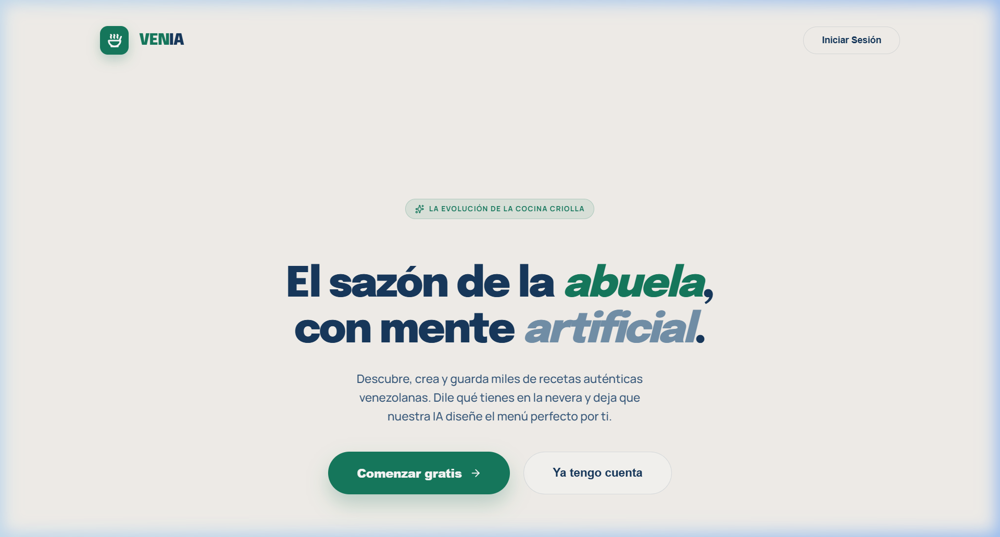
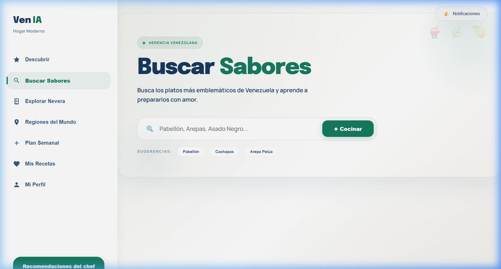
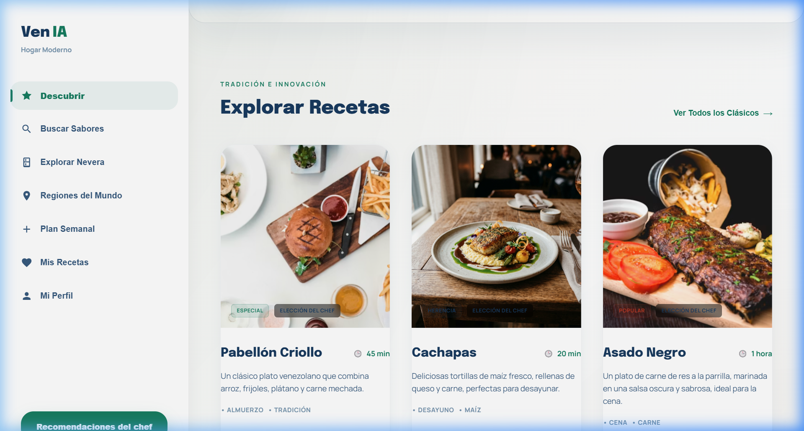
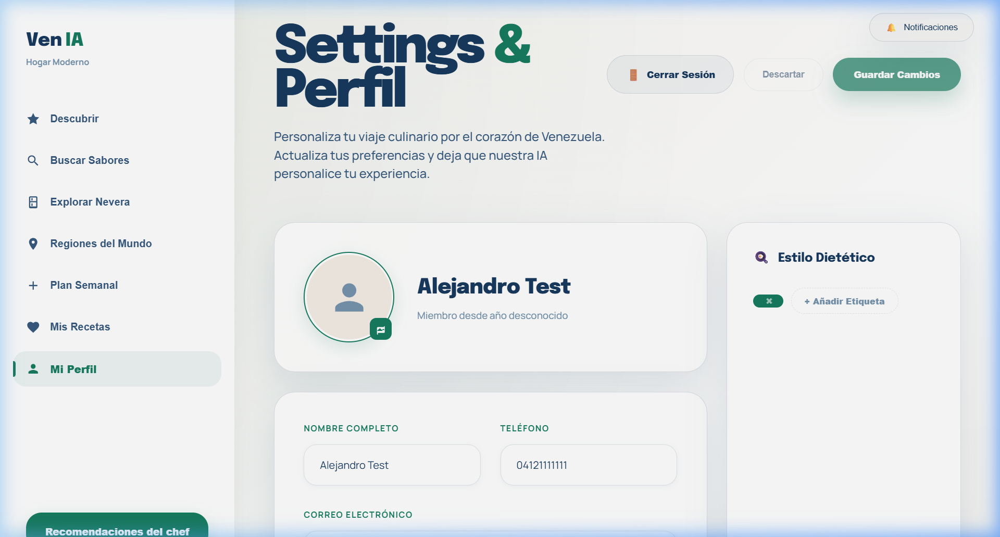

# Recetario Digital

## Descripción General
Este proyecto es una plataforma web de recetario digital que permite a los usuarios explorar, crear y gestionar recetas culinarias, así como planificar menús semanales y descubrir recetas de diferentes regiones del mundo.

## Estructura del Proyecto

- **backend/**: Servidor Node.js encargado de la lógica de negocio, autenticación, gestión de usuarios, recetas y comunicación con la base de datos.
  - `server.js`: Punto de entrada del servidor.
  - `bot_planner.js` y `bot_whatsapp.js`: Integraciones con bots para planificación y WhatsApp.
  - `carpeta_base_datos/`: Módulos para conexión y operaciones con la base de datos.
  - `middleware/`: Middleware de autenticación y seguridad.
- **fronted/**: Aplicación React para la interfaz de usuario.
  - `src/`: Componentes, vistas y servicios de la app.
  - `assets/app_screenshots/`: Imágenes de ejemplo de la aplicación.

## Comunicación Backend-Frontend

La comunicación entre el backend y el frontend se realiza mediante API REST sobre HTTPS. El backend expone endpoints protegidos para autenticación, gestión de usuarios y recetas. Los datos sensibles (como contraseñas) se transmiten cifrados y se almacenan usando técnicas de hashing y encriptación en la base de datos.

- **Autenticación**: Se utiliza JWT (JSON Web Tokens) para mantener sesiones seguras.
- **Subida de imágenes**: Las fotos de recetas se suben desde el frontend al backend, que las almacena de forma segura y devuelve URLs accesibles para su visualización.

## Ejemplo de Imágenes de la Aplicación

Las siguientes imágenes muestran ejemplos de las funcionalidades:

*Pantalla de inicio*

*Búsqueda de recetas*

*Descubrimiento de recetas por región*

*Vista de perfil de usuario*

## Funcionalidades Principales
- Registro y login de usuarios.
- Recuperación de contraseña.
- Creación, edición y eliminación de recetas.
- Planificación semanal de menús.
- Descubrimiento de recetas por país o región.
- Subida y visualización de imágenes de recetas.
- Notificaciones y panel de usuario.

## APIs y Librerías Utilizadas
- **Backend**:
  - Express.js: Framework principal del servidor.
  - JWT: Autenticación y manejo de sesiones.
  - Bcrypt/Encriptación: Seguridad de contraseñas y datos sensibles.
  - Base de datos (ej: MongoDB o similar, según configuración).
- **Frontend**:
  - React: Construcción de la interfaz de usuario.
  - Axios/Fetch: Comunicación con la API.
  - Vite: Herramienta de build y desarrollo.

## Bot de WhatsApp (bot_whatsapp.js)
El sistema cuenta con un bot de WhatsApp que permite enviar notificaciones o mensajes automáticos a los usuarios. El bot utiliza la librería `whatsapp-web.js` y se autentica mediante un código QR escaneado desde la cuenta de WhatsApp configurada.

- El bot se inicializa y espera a estar listo antes de enviar mensajes.
- Los números de teléfono se limpian y formatean automáticamente para cumplir con el formato internacional requerido por WhatsApp.
- El bot puede ser utilizado para enviar recordatorios, confirmaciones u otras notificaciones relevantes a los usuarios.

**Funcionamiento básico:**
1. Al iniciar el bot, se muestra un código QR en consola para vincular la sesión de WhatsApp.
2. Una vez conectado, el bot puede enviar mensajes a cualquier número válido usando la función `enviarMensajeWasap`.
3. El bot maneja reconexiones y errores de autenticación automáticamente.

## Almacenamiento Seguro en la Base de Datos
Todos los datos sensibles de los usuarios (nombre, email, teléfono, preferencias) se almacenan en la base de datos de forma cifrada usando algoritmos de encriptación personalizados. Las contraseñas se almacenan usando hashing seguro (`bcrypt` con salt).

- **Encriptación:** Los datos personales se cifran antes de guardarse, y se desencriptan solo cuando es necesario para autenticación o visualización.
- **Hashing de contraseñas:** Las contraseñas nunca se almacenan en texto plano, sino como hashes seguros.
- **Validaciones:** Se realizan validaciones estrictas de formato y longitud para todos los campos.
- **Recuperación de cuenta:** Los códigos de recuperación también se almacenan hasheados y nunca en texto plano.

Esto garantiza que, incluso si la base de datos es comprometida, los datos de los usuarios no sean legibles ni reutilizables.

## Ejecución
1. Instalar dependencias en backend y frontend (`npm install`).
2. Iniciar el backend (`npm start` o `node server.js`).
3. Iniciar el frontend (`npm run dev`).

---

Para más detalles, consulta los archivos README de cada subcarpeta o la documentación interna de cada módulo.
